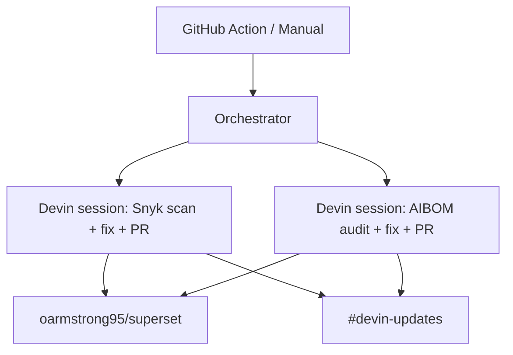

# Devin Guardian

Automated security remediation and AI governance for open-source projects, powered by the [Devin API](https://docs.devin.ai/api-reference/overview) and [Snyk MCP](https://docs.snyk.io/).

The orchestrator dispatches two Devin sessions against a target repository:

1. **Security** -- Devin runs Snyk SCA + SAST scans, fixes high/critical vulnerabilities, and opens a PR.
2. **AI Governance** -- Devin runs a Snyk AIBOM scan, creates a tracking issue for unapproved AI providers, replaces them with Google Gemini, and opens a PR.

Devin posts progress updates to Slack via the Slack MCP at each milestone.

## Architecture



## Quick Start

```bash
git clone https://github.com/oarmstrong95/devin-guardian.git
cd devin-guardian
cp .env.example .env   # fill in credentials
pip install -r requirements.txt
python -m src
```

Or with Docker:

```bash
docker compose up
```

## Configuration

| Variable | Required | Description |
|----------|----------|-------------|
| `DEVIN_API_KEY` | Yes | Devin service user token (`cog_...`) |
| `DEVIN_ORG_ID` | Yes | Devin organization ID |
| `TARGET_REPO` | No | Target repo (default: `oarmstrong95/superset`) |

## Project Structure

```
src/
  __main__.py       Entry point
  config.py         Environment variables
  orchestrator.py   Dispatches Devin sessions
  prompts.py        Prompt templates (security + governance)
Dockerfile
docker-compose.yml
.github/workflows/guardian.yml
```

## Devin MCP Setup

Before running, configure these MCPs in Devin's MCP marketplace:

**Snyk** ([guide](https://docs.snyk.io/integrations/snyk-studio-agentic-integrations/quickstart-guides-for-snyk-studio/devin-guide)):
1. Go to **Settings > MCP marketplace > Add your own**
2. Command: `npx`, Arguments: `-y snyk@latest mcp -t stdio --disable-trust`
3. Add secret: `SNYK_TOKEN` with your Snyk API token

**Slack**: Install the Slack MCP from the marketplace and connect it to your workspace.

## Target Repository

[oarmstrong95/superset](https://github.com/oarmstrong95/superset) -- a fork of Apache Superset with AI model references seeded in existing files for Devin to discover and remediate.
