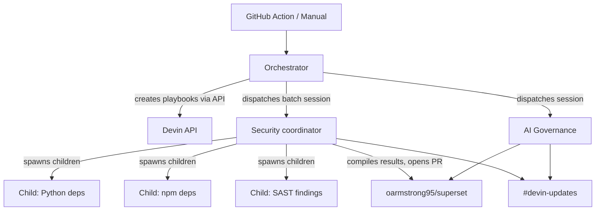

# Devin Guardian

Automated security remediation and AI governance for open-source projects, powered by [Devin Playbooks](https://docs.devin.ai), [Batch Mode](https://docs.devin.ai), and [Snyk MCP](https://docs.snyk.io/).

The orchestrator creates three playbooks and dispatches Devin sessions against a target repository:

1. **Security Coordinator** (`!guardian-security`) -- runs Snyk SCA + SAST scans, creates issues, then delegates remediation to parallel child sessions via batch mode.
2. **Security Fix** (`!guardian-security-fix`) -- child playbook that fixes a specific group of vulnerabilities (Python deps, npm deps, or SAST findings).
3. **AI Governance** (`!guardian-governance`) -- runs a Snyk AIBOM scan, creates a tracking issue for unapproved AI providers, replaces them with Google Gemini, and opens a PR.

Devin posts progress updates to Slack via the Slack MCP at each milestone.

## Architecture



## How It Works

1. **Playbook creation** -- on startup, the orchestrator calls `POST /v1/playbooks` to create (or update) the three playbooks. This is idempotent; existing playbooks are matched by macro name.
2. **Batch mode** -- the security session is dispatched with `advanced_mode: "batch"` and a `child_playbook_id`. Devin's coordinator scans, groups findings, and spins up isolated child VMs per group that run in parallel.
3. **Consolidation** -- the coordinator waits for children, merges their work, and opens a single PR.
4. **Governance** -- runs as a standard session with its own playbook (no batching needed).

## Quick Start

```bash
git clone https://github.com/oarmstrong95/devin-guardian.git
cd devin-guardian
cp .env.example .env   # fill in credentials
pip install -r requirements.txt
python -m src
```

Or with Docker:

```bash
docker compose up
```

## Configuration

| Variable | Required | Description |
|----------|----------|-------------|
| `DEVIN_API_KEY` | Yes | Devin service user token (`cog_...`) |
| `DEVIN_ORG_ID` | Yes | Devin organization ID |
| `TARGET_REPO` | No | Target repo (default: `oarmstrong95/superset`) |
| `SECURITY_PLAYBOOK_ID` | No | Cache the security playbook ID across runs |
| `GOVERNANCE_PLAYBOOK_ID` | No | Cache the governance playbook ID across runs |
| `SECURITY_FIX_PLAYBOOK_ID` | No | Cache the child playbook ID across runs |

## Project Structure

```
src/
  __main__.py       Entry point
  config.py         Environment variables + playbook ID cache
  orchestrator.py   Creates playbooks, dispatches sessions
  prompts.py        Playbook body templates (coordinator, child, governance)
Dockerfile
docker-compose.yml
.github/workflows/guardian.yml
```

## Playbooks

Playbooks are created automatically on the first run and visible in the Devin UI. Anyone on the team can trigger them directly from any session:

| Macro | Purpose | Mode |
|-------|---------|------|
| `!guardian-security` | Scan + coordinate parallel remediation | Batch (coordinator) |
| `!guardian-security-fix` | Fix a specific vulnerability group | Child session |
| `!guardian-governance` | AIBOM audit + Gemini migration | Standard |

## Devin MCP Setup

Before running, configure these MCPs in Devin's MCP marketplace:

**Snyk** ([guide](https://docs.snyk.io/integrations/snyk-studio-agentic-integrations/quickstart-guides-for-snyk-studio/devin-guide)):
1. Go to **Settings > MCP marketplace > Add your own**
2. Command: `npx`, Arguments: `-y snyk@latest mcp -t stdio --disable-trust`
3. Add secret: `SNYK_TOKEN` with your Snyk API token

**Slack**: Install the Slack MCP from the marketplace and connect it to your workspace.

## Target Repository

[oarmstrong95/superset](https://github.com/oarmstrong95/superset) -- a fork of Apache Superset with AI model references seeded in existing files for Devin to discover and remediate.
